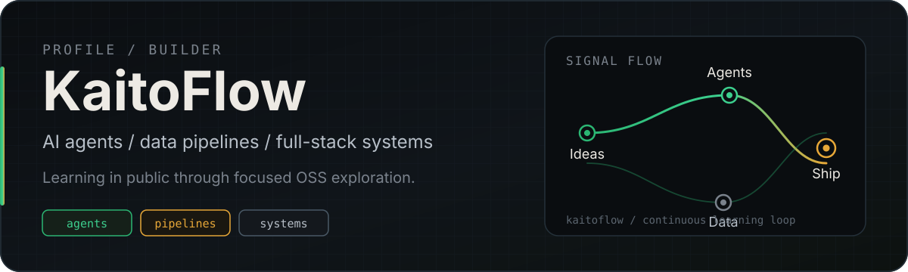
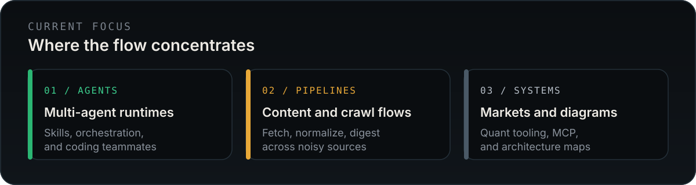
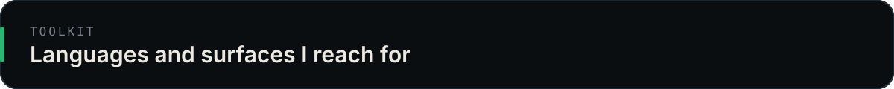
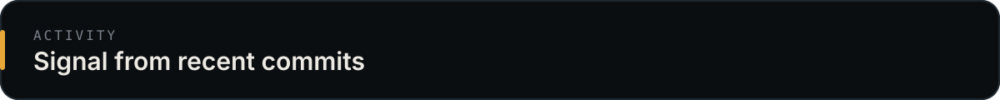

  

  <strong>Full-stack builder</strong> exploring how agents, pipelines, and interfaces fit together. 
  I learn in public by studying and forking the OSS systems that move the field forward.

  
  

---

  

### Exploring right now

Selected forks I’m studying — not claiming authorship, just mapping the terrain:

| Lane | Repositories |
| --- | --- |
| **Agents** | [agency-agents](https://github.com/kaitoflow/agency-agents) · [Auto-Claude](https://github.com/kaitoflow/Auto-Claude) · [multica](https://github.com/kaitoflow/multica) · [agent-skills](https://github.com/kaitoflow/agent-skills) |
| **Pipelines** | [feedgrab](https://github.com/kaitoflow/feedgrab) · [Scrapling](https://github.com/kaitoflow/Scrapling) · [crawl4ai](https://github.com/kaitoflow/crawl4ai) · [TrendRadar](https://github.com/kaitoflow/TrendRadar) |
| **Systems** | [nofx](https://github.com/kaitoflow/nofx) · [Kronos](https://github.com/kaitoflow/Kronos) · [fireworks-tech-graph](https://github.com/kaitoflow/fireworks-tech-graph) · [Awesome-MCP-ZH](https://github.com/kaitoflow/Awesome-MCP-ZH) |

---

  

  

  Frontend when needed · backend by default · agents and data when it gets interesting

---

  

  
  

  

  

---

### Open to

- Collaborating on agent tooling, crawl/digest pipelines, or systems diagrams
- Reviewing architecture trade-offs and learning from sharp codebases
- Building small, honest prototypes instead of slideware

  <em>Say hello via GitHub — <a href="https://github.com/kaitoflow">@kaitoflow</a></em>

